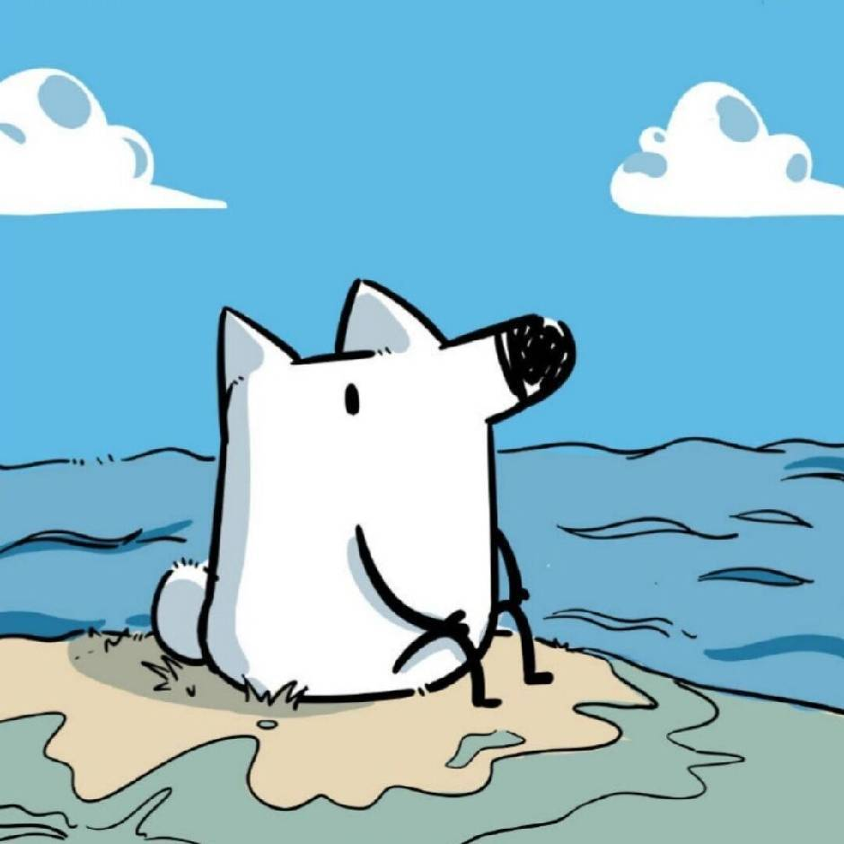

<h1 align="center">Hi👋, I'm Nop 正在研究IOT、IOV、移动安全、V8</h1>
<h3 align="center"></h3>

<picture>
  <source media="(prefers-color-scheme: dark)" srcset="https://raw.githubusercontent.com/Nop3z/Nop3z/output/github-contribution-grid-snake-dark.svg">
  <source media="(prefers-color-scheme: light)" srcset="https://raw.githubusercontent.com/Nop3z/Nop3z/output/github-contribution-grid-snake.svg">
  
</picture>

# 友链(欢迎各位师傅互换友链 )
--------------------------

<table style="width: 100%; table-layout: fixed;">
  <tr>
    <td style="width: 14.28%; text-align: center;">
      
    </td>
    <td style="width: 14.28%; text-align: center;">
      
    </td>
    <td style="width: 14.28%; text-align: center;">
      
    </td>
    <td style="width: 14.28%; text-align: center;">
      
    </td>
    <td style="width: 14.28%; text-align: center;">
      
    </td>
    <td style="width: 14.28%; text-align: center;">
      
    </td>
    <td style="width: 14.28%; text-align: center;">
      
    </td>
  </tr>
  <tr>
    <td style="width: 14.28%; text-align: center;">
      
    </td>
    <td style="width: 14.28%; text-align: center;">
      
    </td>
    <td style="width: 14.28%; text-align: center;">
      
    </td>
    <td style="width: 14.28%; text-align: center;">
      
    </td>
    <td style="width: 14.28%; text-align: center;">
      
    </td>
    <td style="width: 14.28%; text-align: center;">
      
    </td>
    <!-- 添加更多的博客链接 -->
  </tr>
</table>

